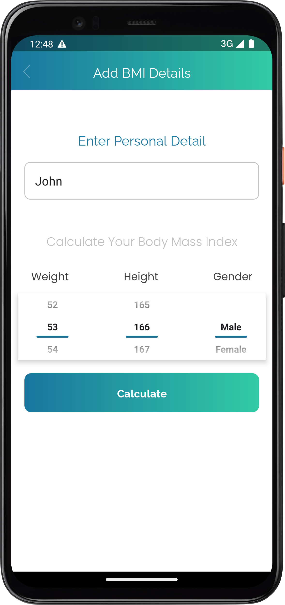
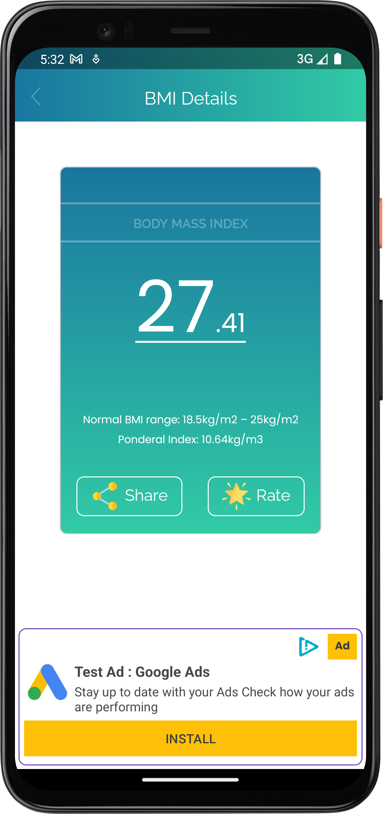

### BMI Calculator



[bmi_video.webm](images/bmi_video.webm)

### Introduction
Welcome to the BMI Calculator Android App! This Kotlin-based application is designed to help you easily calculate your Body Mass Index (BMI) on your Android device. BMI is measure of body fat based on your height and weight, providing insights into whether you are underweight, overweight, or obese. This handy app will assist you in assessing your overall health and understanding your body's condition.


## Features
- **BMI Calculation**: Our app offers a simple and user-friendly interface for calculating your BMI. It takes your height and weight, to quickly determine your BMI value.
- **Instant Results**: After entering your name,height,weight and gender, the app instantly provides your BMI value.

## Requirements
* To build and run this project, you'll need:

1. Android Studio
2. Android SDK
3. Kotlin

### Getting Started
* Clone the Repository

```Copy URL
 git clone https://github.com/your-username/xxxxxxx.git
```

## Open in Android Studio
- Launch Android Studio.
- Select "Get project from version control"
- Clone project

## Build and Run
- Connect your Android device.
- Build and run the project.

## Usage
* Launch the app.

# Calculate BMI
- Entering your name,height,weight and gender and tap on "Calculate"
- BIM details screen will be open and you'll find your BMI result.

